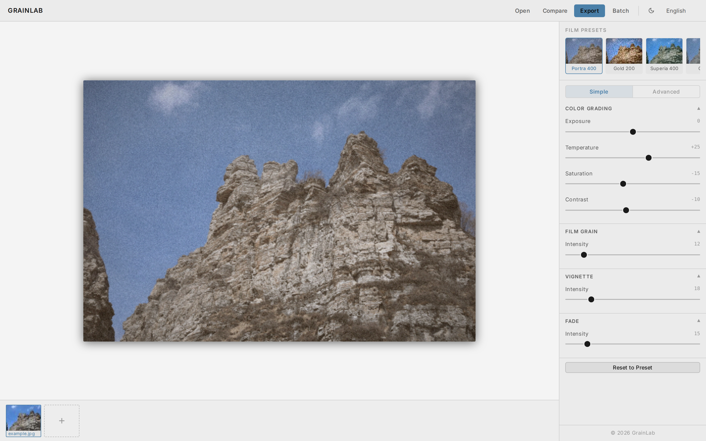
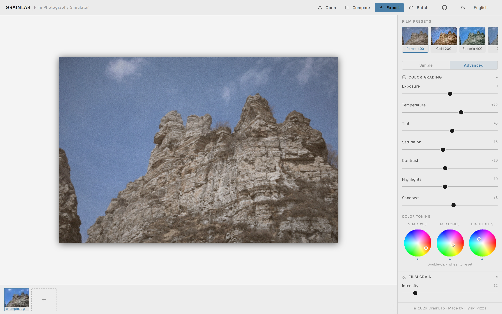
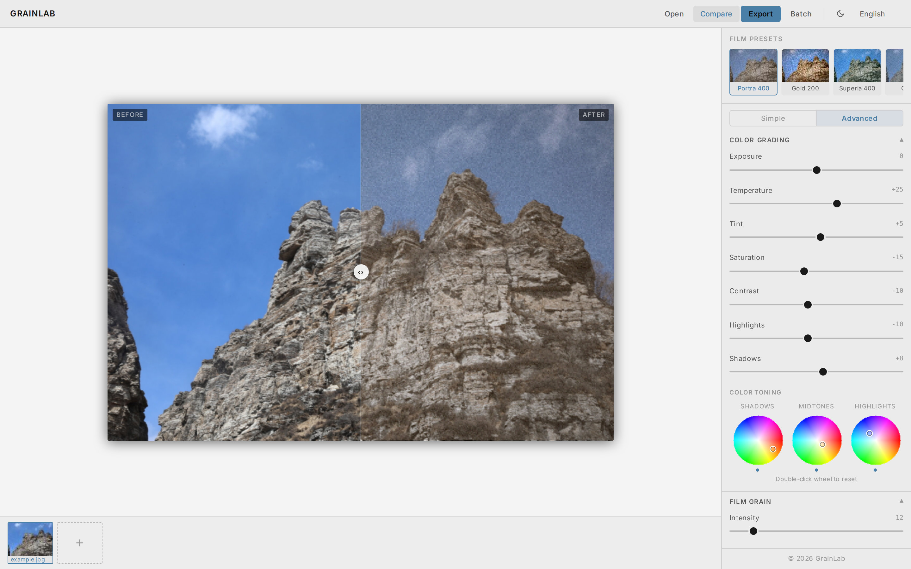
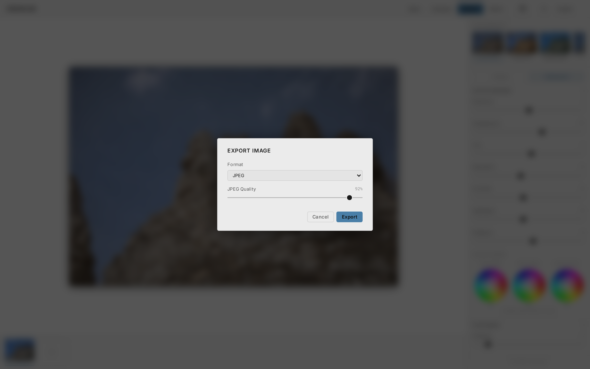

<div align="center">

# GrainLab

**胶片摄影效果模拟器**

[](https://github.com/seamys/grainlab)
[](LICENSE)
[](https://seamys.github.io/grainlab/)

**[🌐 在线体验](https://seamys.github.io/grainlab/) · [English](README.md)**

在浏览器中，为你的数码照片赋予经典模拟胶片的质感与色调。无需安装，无需注册，完全免费。

</div>

---


---

## ✨ 核心功能一览

| 功能 | 说明 |
|------|------|
| 🎞️ **11 种胶片预设** | 一键模拟经典胶卷风格（柯达 Portra、富士 Velvia、CineStill 800T 等） |
| 🎛️ **8 种可调效果** | 颗粒感、色彩分级、暗角、漏光、褪色、光晕、光晕发光、色调曲线 |
| 🖼️ **前后对比** | 可拖动分割线，随时对比调整前后效果 |
| 📦 **批量导出** | 对多张图片应用同一预设，一键打包为 ZIP 下载 |
| 💾 **自动保存** | 通过 IndexedDB 自动保存图库与参数，刷新后依然还原 |
| 🌍 **9 种语言** | 中 / 英 / 日 / 韩 / 法 / 德 / 西 / 葡 / 繁中 |
| 🌙 **深色 / 浅色主题** | 一键切换 |

---

## 🚀 快速开始

打开在线应用，无需任何安装：

**[https://seamys.github.io/grainlab/](https://seamys.github.io/grainlab/)**

---

## 📖 使用教程

### 1. 加载图片

- 将照片**直接拖放**到画布区域，或者
- 按快捷键 **Ctrl + O**（macOS：**⌘ + O**）打开文件选择器。

支持格式：JPG · PNG · GIF · WebP · BMP · TIFF

> 如果图库为空，应用会自动加载一张内置示例图片，你可以立即开始体验。

---

### 2. 应用胶片预设



点击左侧面板的 **预设** 选项卡，浏览 11 种精心调制的胶片模拟风格。将鼠标悬停在任意预设上可查看描述，点击即可一键应用。

| 预设 | 风格特点 |
|------|---------|
| Kodak Portra 400 | 温暖人像色调，柔和高光 |
| Kodak Gold 200 | 鲜艳暖色调，适合旅行 |
| Kodak Ektar 100 | 超高饱和度，细腻颗粒 |
| Kodak Tri-X 400 | 高对比黑白，粗犷颗粒 |
| Fuji Superia 400 | 清新绿调，色彩均衡 |
| Fuji C200 | 清淡冷调，低对比度 |
| Fuji Velvia 50 | 极高饱和，深邃蓝绿 |
| Fuji Eterna 500 | 电影感，低饱和，柔和阴影 |
| Ilford HP5 Plus | 经典黑白，强颗粒 |
| CineStill 800T | 钨丝灯冷调，红色光晕 |
| Agfa Vista 200 | 复古暖调，洋红阴影 |

---

### 3. 精细调整效果


**调整** 选项卡提供 8 个独立效果层。点击顶部的 **简单 / 高级** 切换按钮，可显示或隐藏每个通道的精细控制项。

| 效果 | 主要参数 |
|------|---------|
| **色彩分级** | 曝光 · 色温 · 色调 · 饱和度 · 对比度 · 高光 · 阴影 |
| **胶片颗粒** | 强度 · 大小 · 色彩偏差 · 阴影增强 · 高光减弱 |
| **暗角** | 强度 · 半径 · 羽化 · 颜色（黑→白） |
| **漏光** | 强度 · 颜色（暖/冷/复古） · 位置（四角） |
| **褪色** | 强度 — 提亮暗部，营造复古水洗感 |
| **光晕** | 强度 · 颜色（红/暖/金） · 半径 |
| **发光** | 强度 · 阈值 · 半径 |
| **色调曲线** | 阴影 · 中间调 · 高光（五点样条曲线） |

切换到**高级**模式，可解锁**色彩调色轮**功能 — 三个独立的 RGB 色彩拾取器，分别控制阴影、中间调和高光的色偏，让你对照片整体氛围进行更精细的创意调整。



---

### 4. 前后效果对比



点击工具栏中的**对比按钮**（缩放控件旁边的图标）进入分割视图模式。左右拖动分割线，可随意显示原图或处理后的图像。

---

### 5. 导出单张图片



1. 点击**导出**按钮（或按快捷键 **Ctrl + S** / **⌘ + S**）。
2. 选择 **JPEG**（可拖动质量滑块 1–100%）或 **PNG**（无损）。
3. 点击**下载** — 文件将以 `{原文件名}_film.jpg/png` 保存到本地。

---

### 6. 批量处理


1. 从工具栏打开**批量**面板。
2. 在图库中选择要处理的多张图片。
3. 选择预设和导出格式。
4. 点击**全部导出** — 所有处理后的图片将打包为 `film_batch.zip` 下载。

---

### 7. 图库与会话持久化

屏幕底部的**胶片条**显示已加载图片的缩略图。点击任意缩略图可切换到该图片。整个图库（包括图片及每张图的参数设置）会自动保存在浏览器的 IndexedDB 中，下次打开应用时自动还原。

点击胶片条中的 **＋** 按钮可添加更多图片。  
点击缩略图上的 **✕** 按钮可删除该图片。

---

## ⌨️ 键盘快捷键

| 快捷键 | 功能 |
|--------|------|
| `Ctrl + O` | 打开/导入图片 |
| `Ctrl + S` | 导出当前图片 |
| `Ctrl + +` | 放大 |
| `Ctrl + -` | 缩小 |
| `Ctrl + 0` | 重置缩放比例 |

> macOS 用户：将 **Ctrl** 替换为 **⌘**

---

## 🌍 支持语言

GrainLab 自动检测浏览器语言，也可在右上角语言选择器中手动切换。

简体中文 · English · 繁體中文 · 日本語 · 한국어 · Français · Deutsch · Español · Português

---

## 🛠️ 技术栈（开发者参考）

| 技术 | 用途 |
|------|------|
| Vue 3 + TypeScript | UI 框架 |
| Vite | 构建工具 |
| Pinia | 状态管理 |
| Vue I18n | 国际化 |
| Web Workers | 非阻塞滤镜处理 |
| IndexedDB | 图库持久化 |
| JSZip | 批量 ZIP 导出 |

### 本地开发

```bash
npm install
npm run dev      # http://localhost:5173
npm run build    # 生产构建
npm run preview  # 预览生产构建
```

---

## 📄 开源许可

[MIT](LICENSE) © GrainLab
